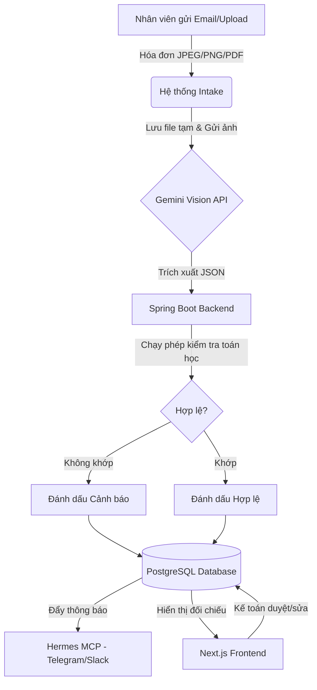

# Software Requirements Specification (SRS)
## Dự án: Hệ thống tự động hóa Thu thập và Đối chiếu Hóa đơn (OCR Invoice Engine)

| Phiên bản | Ngày | Người thực hiện | Trạng thái |
|---|---|---|---|
| v1.0 | 2026-06-26 | Antigravity | Hoàn thành dự thảo |

---

## 1. Giới thiệu (Introduction)

### 1.1 Mục đích (Purpose)
Tài liệu Đặc tả Yêu cầu Phần mềm (SRS) này mô tả chi tiết các yêu cầu chức năng, phi chức năng, kiến trúc dữ liệu và ràng buộc hệ thống cho dự án **OCR Invoice Engine**. Hệ thống này tự động hóa toàn bộ quy trình thu thập hóa đơn từ email, trích xuất dữ liệu bằng AI (Gemini Vision API), xác thực tính toán tài chính, lưu trữ có cấu trúc vào PostgreSQL và cung cấp giao diện Web trực quan để kiểm đối và phê duyệt dữ liệu.

### 1.2 Phạm vi (Scope)
Hệ thống bao gồm:
- **Email Inbound Intake Pipeline:** Định kỳ quét hòm thư qua giao thức IMAP, tải xuống các hóa đơn đính kèm (ảnh/PDF).
- **OCR & Extraction Core (Gemini API):** Trích xuất thông tin hóa đơn sang cấu trúc JSON chuẩn hóa.
- **Backend Service (Spring Boot):** Xử lý luồng dữ liệu, xác thực toán học, quản lý lưu trữ PostgreSQL và bắn thông báo qua MCP Hermes (Telegram/Slack).
- **Interactive Verification Dashboard (Next.js):** Giao diện cho kế toán hoặc quản trị viên đối chiếu dữ liệu trích xuất dạng song song (Side-by-side) và chỉnh sửa, duyệt lưu trữ.

---

## 2. Mô tả Tổng quan (Overall Description)

### 2.1 Tác nhân Hệ thống (User Personas)
1.  **Nhân viên thanh toán (Employee):** Người chi tiêu và gửi hóa đơn (qua email hoặc tải lên trực tiếp trên Web) để yêu cầu thanh toán/hoàn ứng.
2.  **Kế toán viên (Accountant):** Người kiểm tra, điều chỉnh dữ liệu trích xuất sai lệch (nếu có) trên Dashboard và phê duyệt đưa vào hệ thống kế toán chính.
3.  **Hệ thống tích hợp (System API / MCP Client):** Các ứng dụng bên ngoài truy cập dữ liệu hóa đơn thông qua REST API hoặc MCP server.

### 2.2 Sơ đồ Luồng Nghiệp vụ (Data Flow Diagram)



---

## 3. Yêu cầu Chức năng (Functional Requirements)

### 3.1 Chức năng Thu thập Tự động (Email Inbound Intake)
- **FR-01.1:** Hệ thống phải định kỳ (cấu hình mặc định 5 phút) quét hòm thư email được chỉ định qua giao thức IMAPS (cổng 993).
- **FR-01.2:** Hệ thống chỉ xử lý các thư chưa đọc (UNSEEN). Sau khi xử lý xong, thư phải được đánh dấu là đã đọc (SEEN).
- **FR-01.3:** Hệ thống phải lọc và tải các tệp đính kèm có định dạng được hỗ trợ: `.png`, `.jpg`, `.jpeg`, `.pdf`. Các định dạng khác sẽ bị bỏ qua.
- **FR-01.4:** Lưu trữ tệp đính kèm vào thư mục lưu trữ cục bộ (hoặc Cloud Storage) và ghi nhận đường dẫn tệp (`filePath`).

### 3.2 Chức năng Trích xuất Dữ liệu bằng AI (Gemini OCR Service)
- **FR-02.1:** Gửi file ảnh hoặc trang đầu của tệp PDF sang Gemini Vision API để thực hiện nhận diện.
- **FR-02.2:** Sử dụng kỹ thuật Structured Outputs (JSON Schema) để ép buộc Gemini trả về cấu trúc dữ liệu chính xác theo đặc tả (Xem mục 4).
- **FR-02.3:** Hỗ trợ xử lý đa dạng loại hóa đơn tại Việt Nam:
  - Hóa đơn điện tử VAT (có mã số thuế, ký hiệu, số hóa đơn).
  - Biên lai bán lẻ giấy nhiệt (Thermal receipts từ cửa hàng ăn uống, siêu thị).
  - Vé cầu đường, biên nhận taxi/Grab.

### 3.3 Chức năng Xác thực & Xử lý Nghiệp vụ (Backend Core)
- **FR-03.1:** **Xác thực toán học (Mathematical Validation):**
  - Kiểm tra điều kiện: $\sum(\text{item.total}) = \text{subtotal}$
  - Kiểm tra điều kiện: $\text{subtotal} + \text{vat} = \text{total}$
- **FR-03.2:** Ghi nhận trạng thái hóa đơn:
  - `VALIDATED`: Nếu các điều kiện toán học khớp hoàn toàn.
  - `WARNING`: Nếu có sai lệch số liệu (Gemini đọc nhầm số hoặc hóa đơn tính sai).
- **FR-03.3:** **Bắn thông báo (Hermes Integration):** Ngay khi hóa đơn được xử lý xong ở Backend, gửi thông báo tóm tắt thông tin hóa đơn (Vendor, Tổng tiền, Trạng thái) sang kênh Telegram hoặc Slack được cấu hình.

### 3.4 Chức năng Giao diện Đối chiếu & Phê duyệt (Next.js UI)
- **FR-04.1:** **Màn hình Danh sách (History/Dashboard):** Hiển thị danh sách hóa đơn đã thu thập, sắp xếp theo thời gian mới nhất, kèm bộ lọc trạng thái (`VALIDATED`, `WARNING`, `APPROVED`).
- **FR-04.2:** **Giao diện Đối chiếu Song Song (Side-by-side Visualizer):**
  - Cột bên trái hiển thị ảnh hoặc file PDF hóa đơn gốc.
  - Cột bên phải hiển thị Form chứa các thông tin đã trích xuất, cho phép chỉnh sửa từng ô nhập liệu.
- **FR-04.3:** **Hành động Phê duyệt (Approve Action):** Cho phép Kế toán viên chỉnh sửa các ô nhập liệu sai sót và bấm nút "Phê duyệt" để lưu trạng thái cuối cùng (`APPROVED`) vào database.

### 3.5 Chi tiết Kịch bản Sử dụng (Use Case Details)

- **UC-01 (Tự động Thu thập & Trích xuất):**
  - *Tác nhân:* Hệ thống (Automated Scheduler).
  - *Luồng chính:* 
    1. Định kỳ quét hòm thư IMAP tìm thư chưa đọc chứa tệp đính kèm.
    2. Tải tệp đính kèm, lưu vào ổ đĩa dự án và tạo bản ghi trạng thái `PROCESSING`.
    3. Gửi tệp sang Gemini API kèm JSON Schema định sẵn.
    4. Nhận kết quả JSON, thực hiện xác thực toán học.
    5. Cập nhật bản ghi với thông tin chi tiết và trạng thái tương ứng (`VALIDATED` hoặc `WARNING`).
    6. Gửi thông báo tóm tắt qua Hermes MCP đến Telegram của đội ngũ kế toán.
- **UC-02 (Đối chiếu & Phê duyệt thủ công):**
  - *Tác nhân:* Kế toán viên (Accountant).
  - *Luồng chính:*
    1. Kế toán truy cập Dashboard Next.js, xem danh sách hóa đơn.
    2. Chọn một hóa đơn có trạng thái `WARNING` hoặc `VALIDATED`.
    3. Hệ thống hiển thị ảnh hóa đơn gốc song song với form nhập liệu.
    4. Kế toán viên đối chiếu, chỉnh sửa các thông số bị lệch (nếu có).
    5. Bấm nút **"Phê duyệt"**. Hệ thống lưu dữ liệu cập nhật và đổi trạng thái thành `APPROVED`.

---

## 4. Đặc tả Cấu trúc Dữ liệu JSON (Data Schema)

Cấu trúc JSON đầu ra yêu cầu từ Gemini API và lưu trữ trong DB:

```json
{
  "vendor": "String (Tên nhà cung cấp/cửa hàng)",
  "tax_code": "String (Mã số thuế bên bán - nullable)",
  "invoice_number": "String (Số hóa đơn/biên lai - nullable)",
  "date": "String (Định dạng YYYY-MM-DD)",
  "items": [
    {
      "name": "String (Tên mặt hàng/dịch vụ)",
      "quantity": "Number (Số lượng)",
      "unit_price": "Number (Đơn giá)",
      "total": "Number (Thành tiền = quantity * unit_price)"
    }
  ],
  "subtotal": "Number (Tổng tiền trước thuế)",
  "vat": "Number (Tiền thuế GTGT)",
  "total": "Number (Tổng cộng tiền thanh toán)"
}
```

---

## 5. Yêu cầu Phi Chức năng (Non-Functional Requirements)

### 5.1 Hiệu năng (Performance)
- **NFR-01.1:** Thời gian phản hồi từ lúc nhận file đến khi trích xuất xong qua Gemini API không quá 10 giây đối với file ảnh thông thường.
- **NFR-01.2:** Hệ thống tải dữ liệu trên trang Dashboard Next.js phải dưới 2 giây với tối đa 100 bản ghi trên mỗi trang.

### 5.2 An toàn & Bảo mật (Security)
- **NFR-02.1:** Giới hạn dung lượng tệp hóa đơn tải lên hoặc đính kèm tối đa là **10MB**.
- **NFR-02.2:** Phải kiểm tra kiểu tệp MIME (MIME Type) ở cấp độ Backend để tránh lỗi tải lên mã độc (chỉ cho phép `image/png`, `image/jpeg`, `application/pdf`).
- **NFR-02.3:** Dữ liệu nhạy cảm (như thông tin cấu hình mail mật khẩu IMAP) phải được mã hóa hoặc cấu hình qua Biến môi trường (Environment Variables), không được ghi cứng vào mã nguồn.

### 5.3 Khả năng Bảo trì & Tiêu chuẩn Code (Maintainability)
- **NFR-03.1:** Dự án tổ chức theo mô hình Monorepo rõ ràng:
  - `apps/backend/`: Spring Boot, Java 21, Gradle Groovy.
  - `apps/frontend/`: Next.js 14.2.x/15.x, TypeScript.
- **NFR-03.2:** Frontend phải áp dụng công cụ **ESLint** để kiểm tra tĩnh mã nguồn và cấu hình **Husky hook** chặn commit nếu có lỗi Lint hoặc định dạng.
- **NFR-03.3:** Toàn bộ tiến trình phát triển phải tuân thủ nghiêm ngặt mô hình **TDD (Test-Driven Development)**: viết test lỗi trước, viết code sau, chạy test xanh mới commit.

---

## 6. Xử lý Ngoại lệ & Kịch bản Lỗi (Exception Flows)

### 6.1 Lỗi Hệ thống ngoài (External Services Failures)
- **EX-01.1 (Gemini API Failure):** Khi kết nối Gemini API bị timeout hoặc hết quota, hệ thống:
  - Lưu hóa đơn với trạng thái `FAILED_EXTRACTION`.
  - Bắn thông báo lỗi chi tiết qua Hermes MCP (Telegram/Slack) để quản trị viên kiểm tra.
  - Cung cấp nút **"Trích xuất lại (Retry)"** trên Frontend để gửi lại ảnh sang Gemini mà không cần upload lại file.
- **EX-01.2 (Email Connection Loss):** Nếu kết nối tới IMAP Server bị lỗi (mất mạng, sai mật khẩu):
  - Ghi nhận Error Log và kích hoạt cơ chế retry tự động sau chu kỳ quét tiếp theo.
  - Không làm sập ứng dụng Backend Spring Boot.

### 6.2 Lỗi Nghiệp vụ & Dữ liệu (Data & Business Validation Failures)
- **EX-02.1 (Math Validation Mismatch):** Nếu tổng các dòng hàng không khớp Subtotal hoặc Subtotal + Thuế không khớp Total:
  - Hệ thống lưu hóa đơn với trạng thái `WARNING`.
  - Trên giao diện Next.js, tô đỏ/highlight các trường bị lệch số liệu để kế toán viên phát hiện ngay lập tức và chỉnh sửa thủ công.
- **EX-02.2 (File Format / Corrupted File Error):** Nếu nhân viên đính kèm file lỗi hoặc định dạng không đúng (ví dụ: file zip hoặc file docx giả dạng ảnh):
  - Đánh dấu trạng thái hóa đơn là `CORRUPTED_FILE`.
  - Gửi thông báo từ chối trực tiếp qua Telegram, nêu rõ tiêu đề thư và tên file bị lỗi để người gửi biết và cập nhật lại.

