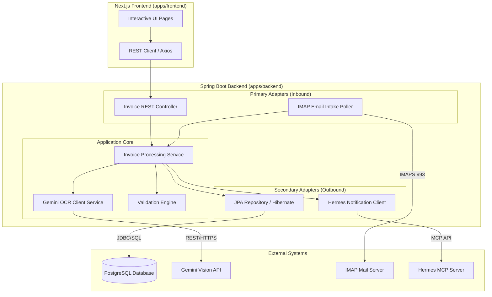
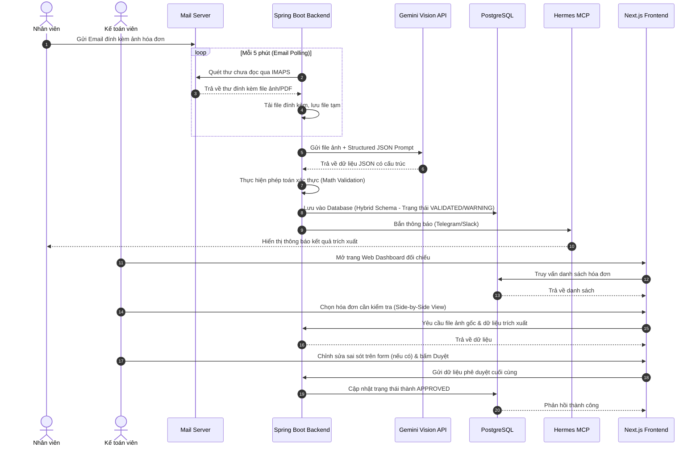

# System Architecture Design (SAD)
## Dự án: Hệ thống tự động hóa Thu thập và Đối chiếu Hóa đơn (OCR Invoice Engine)

| Phiên bản | Ngày | Người thực hiện | Trạng thái |
|---|---|---|---|
| v1.0 | 2026-06-26 | Antigravity | Hoàn thành dự thảo |

---

## 1. Kiến trúc Tổng quan (System Architecture Overview)

Hệ thống được thiết kế theo mô hình **Monorepo** chia sẻ mã nguồn nhưng phân tách triển khai độc lập giữa **Apps/Backend** và **Apps/Frontend**, kết hợp với các cổng giao tiếp kết nối hệ thống bên ngoài thông qua kiến trúc **Hexagonal Architecture (Ports and Adapters)** ở Backend.

### 1.1 Sơ đồ Phân rã Thành phần (Component Diagram)



---

## 2. Thiết kế Cơ sở dữ liệu (Database Schema Design)

Để vừa đảm bảo tốc độ truy vấn báo cáo nhanh, vừa thích ứng linh hoạt với sự thay đổi của các hóa đơn chưa được chuẩn hóa, chúng tôi áp dụng mô hình **Hybrid Schema** (SQL Quan hệ + JSONB).

### 2.1 Bảng `invoices` (Thông tin đầu hóa đơn)
Lưu trữ các trường dữ liệu chung và quan trọng nhất của hóa đơn dùng cho tìm kiếm, thống kê:

| Tên cột | Kiểu dữ liệu | Ràng buộc | Mô tả |
|---|---|---|---|
| `id` | `BIGSERIAL` | `PRIMARY KEY` | Định danh tự động tăng |
| `vendor` | `VARCHAR(255)` | `NOT NULL` | Tên nhà cung cấp |
| `tax_code` | `VARCHAR(50)` | `NULL` | Mã số thuế bên bán (nullable) |
| `invoice_number` | `VARCHAR(50)` | `NULL` | Số hóa đơn (nullable) |
| `invoice_date` | `DATE` | `NULL` | Ngày lập hóa đơn (YYYY-MM-DD) |
| `subtotal` | `NUMERIC(15, 2)` | `NOT NULL` | Tổng tiền trước thuế |
| `vat` | `NUMERIC(15, 2)` | `NOT NULL` | Tiền thuế GTGT |
| `total` | `NUMERIC(15, 2)` | `NOT NULL` | Tổng tiền thanh toán sau thuế |
| `file_path` | `VARCHAR(500)` | `NOT NULL` | Đường dẫn lưu file ảnh/PDF vật lý |
| `status` | `VARCHAR(50)` | `NOT NULL` | Trạng thái: `VALIDATED`, `WARNING`, `APPROVED` |
| `raw_payload` | `JSONB` | `NOT NULL` | Lưu cấu trúc JSON gốc trả về từ Gemini |
| `created_at` | `TIMESTAMP` | `DEFAULT NOW()` | Thời gian hệ thống thu thập |
| `updated_at` | `TIMESTAMP` | `DEFAULT NOW()` | Thời gian cập nhật cuối cùng |

*   **Chỉ mục (Index):**
    *   `idx_invoices_vendor` trên cột `vendor` (Bình thường hóa dạng index B-Tree để tìm kiếm tên cửa hàng).
    *   `idx_invoices_date` trên cột `invoice_date` (Tìm kiếm theo khoảng thời gian).
    *   `idx_invoices_raw_payload` dạng **GIN Index** trên cột `raw_payload` để cho phép truy vấn trực tiếp vào các thuộc tính JSON tùy biến.

### 2.2 Bảng `invoice_items` (Chi tiết dòng hàng)
Lưu trữ chi tiết từng sản phẩm/dịch vụ mua trong hóa đơn:

| Tên cột | Kiểu dữ liệu | Ràng buộc | Mô tả |
|---|---|---|---|
| `id` | `BIGSERIAL` | `PRIMARY KEY` | Định danh tự động tăng |
| `invoice_id` | `BIGINT` | `FOREIGN KEY REFERENCES invoices(id) ON DELETE CASCADE` | Khóa ngoại liên kết hóa đơn |
| `name` | `VARCHAR(500)` | `NOT NULL` | Tên mặt hàng/dịch vụ |
| `quantity` | `NUMERIC(12, 4)` | `NOT NULL` | Số lượng (hỗ trợ số thập phân) |
| `unit_price` | `NUMERIC(15, 2)` | `NOT NULL` | Đơn giá sản phẩm |
| `total` | `NUMERIC(15, 2)` | `NOT NULL` | Thành tiền = Số lượng * Đơn giá |

---

## 3. Luồng hoạt động tuần tự (Sequence Diagram)

Quy trình tự động hóa từ thu thập email đến kiểm đối dữ liệu trên web diễn ra tuần tự như sau:



---

## 4. Đặc tả Cấu trúc Mã nguồn (Project Directory Structure)

Mã nguồn được tổ chức nhất quán để đảm bảo tính module hóa và dễ bảo trì:

```
ocr-invoice-engine/
├── .agent/                  # Cấu hình và Skill của AI Agent
├── apps/
│   ├── backend/             # Dự án Spring Boot (Java 21, Gradle Groovy)
│   │   ├── build.gradle
│   │   └── src/
│   │       ├── main/
│   │       │   ├── java/com/example/ocr/
│   │       │   │   ├── config/       # Cấu hình Mail, Database, Gemini API
│   │       │   │   ├── controller/   # REST API Controller
│   │       │   │   ├── model/        # Entity classes (Invoice, InvoiceItem)
│   │       │   │   ├── repository/   # JPA Repositories
│   │       │   │   ├── service/      # Nghiệp vụ chính & Gemini Client
│   │       │   │   └── OcrApplication.java
│   │       │   └── resources/
│   │       │       └── application.yml
│   │       └── test/                 # Test Cases (JUnit 5, Mockito)
│   └── frontend/            # Dự án Next.js (TypeScript, React)
│       ├── package.json
│       └── src/
│           ├── components/  # Reusable UI Components
│           ├── pages/       # Next.js Pages (Dashboard, Reviewer)
│           └── styles/      # CSS files
├── docs/                    # Tài liệu Obsidian Vault theo chuẩn SOP-DEV-001
│   ├── 01-Requirements/     # SRS-001-ocr-invoice-system.md
│   ├── 02-Design/           # SAD-001-ocr-invoice-architecture.md
│   ├── 03-Specs/            # SPEC-002-ocr-invoice-design.md
│   └── 04-Development/      # PLAN-002, PLAN-04, task.md
└── .gitignore
```
